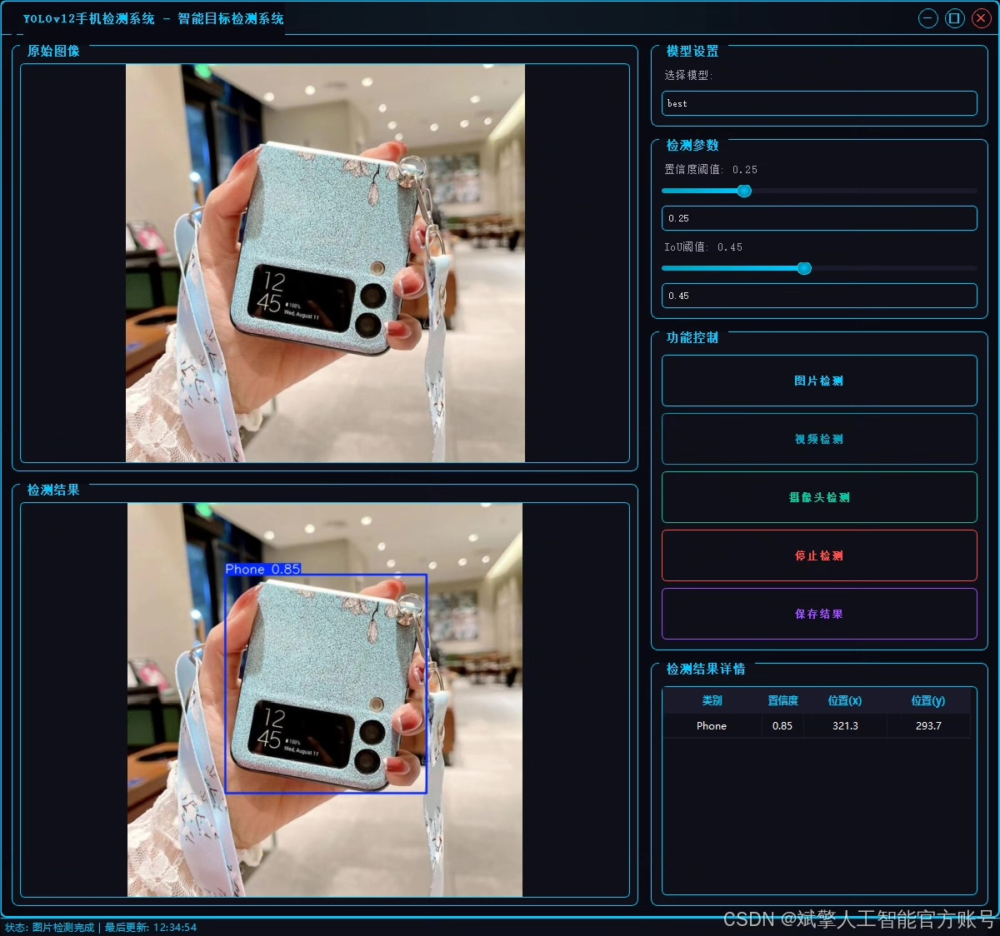
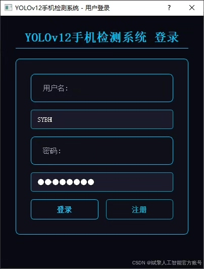
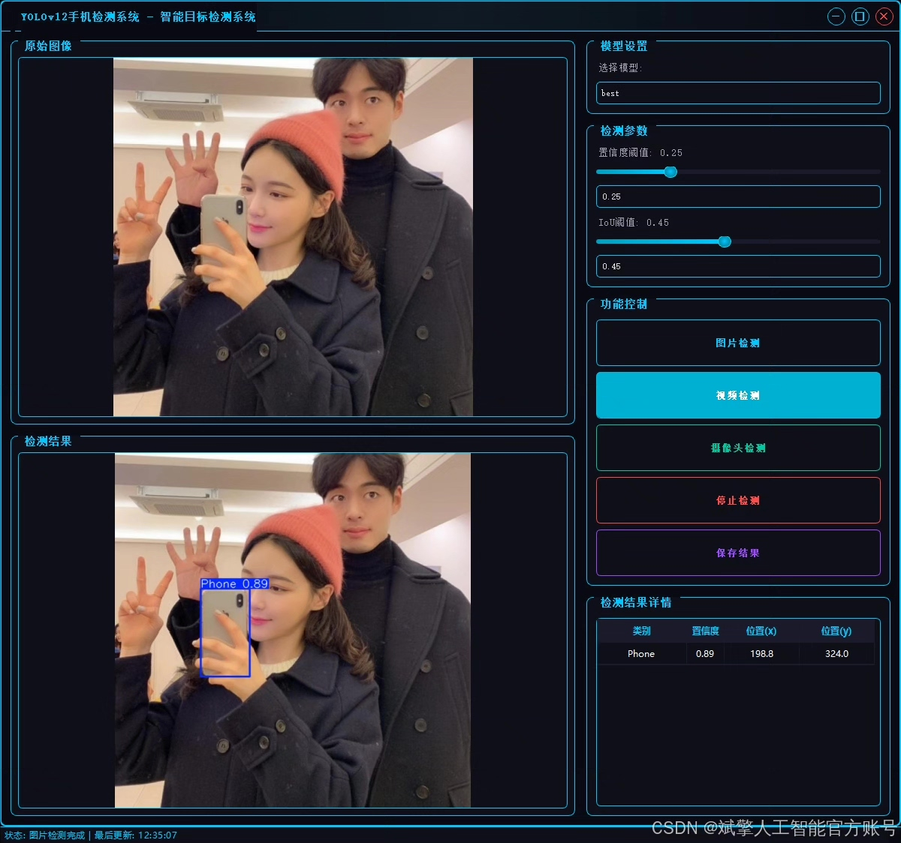
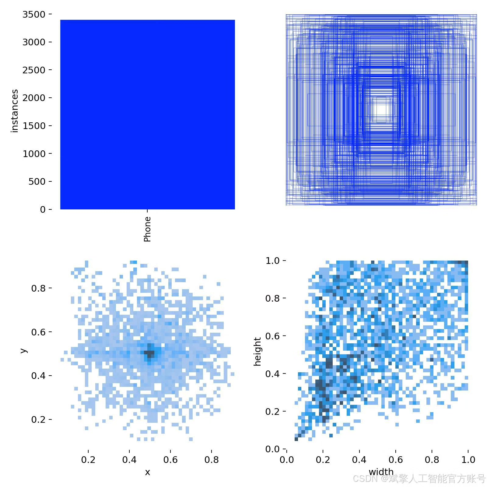
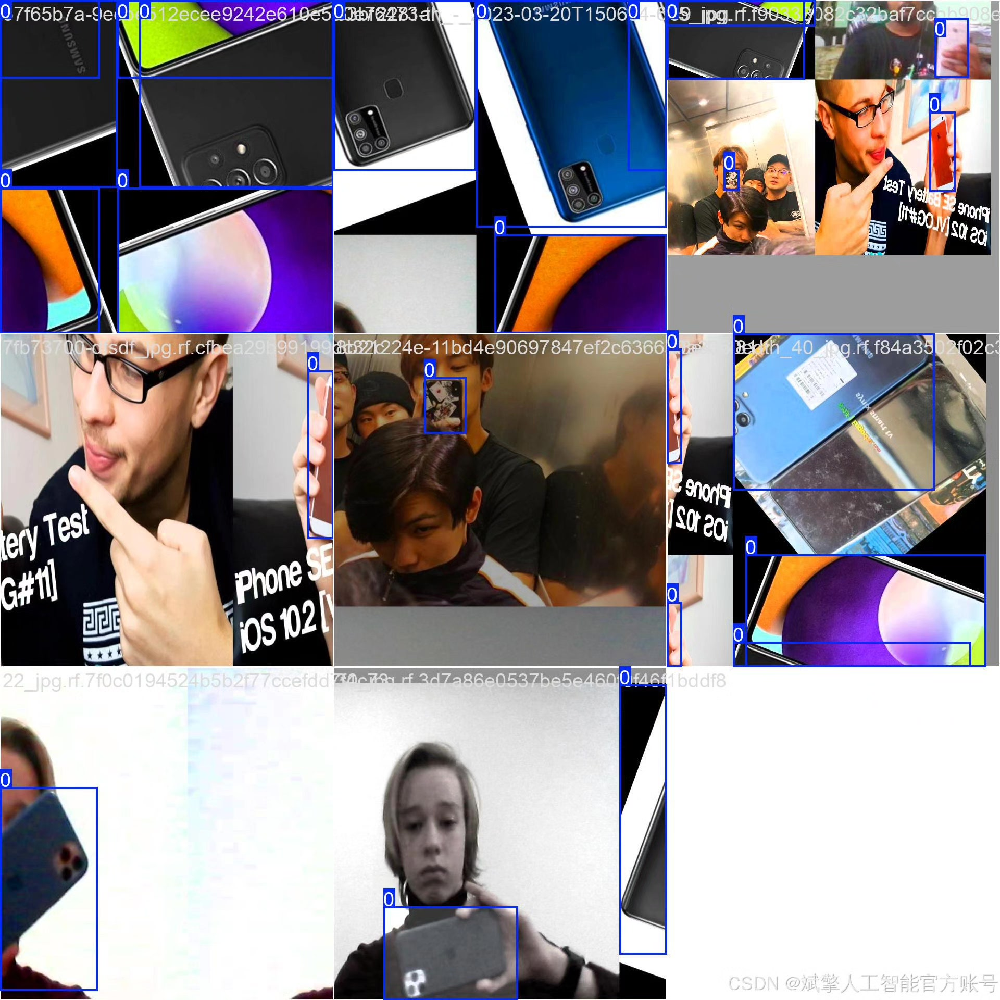
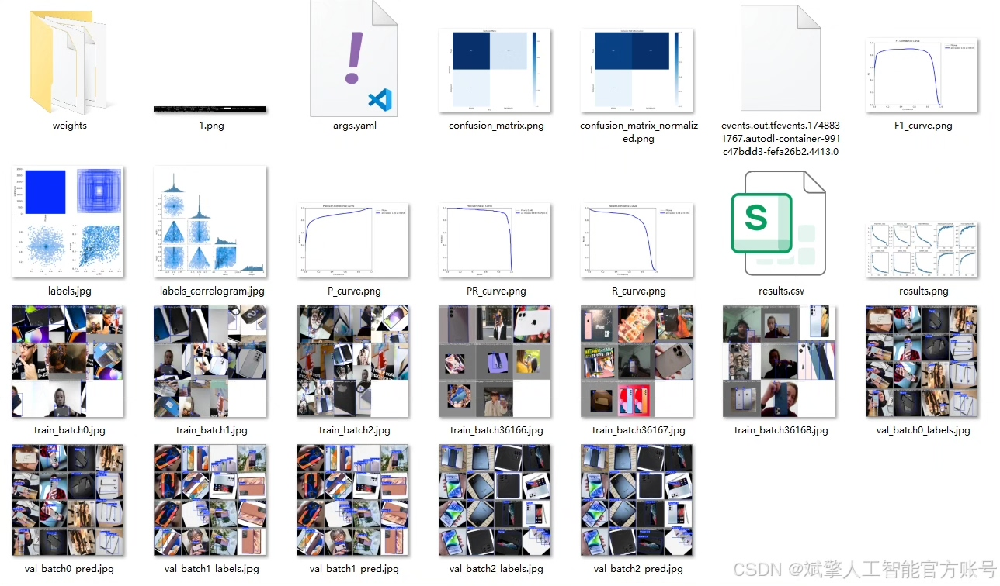
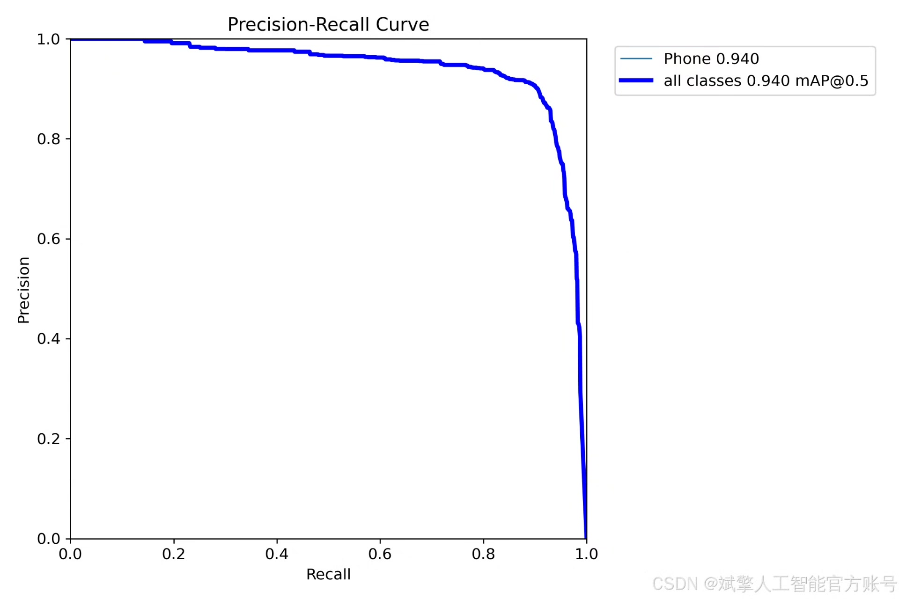
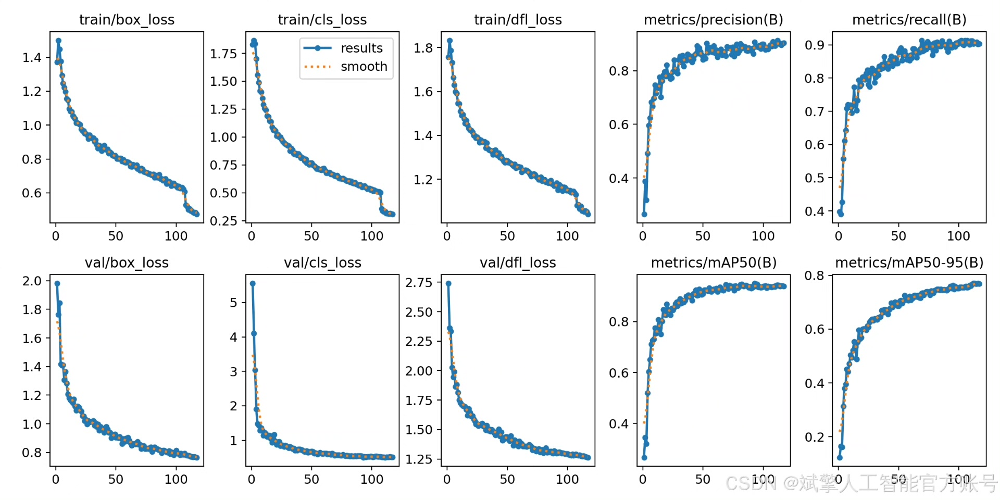
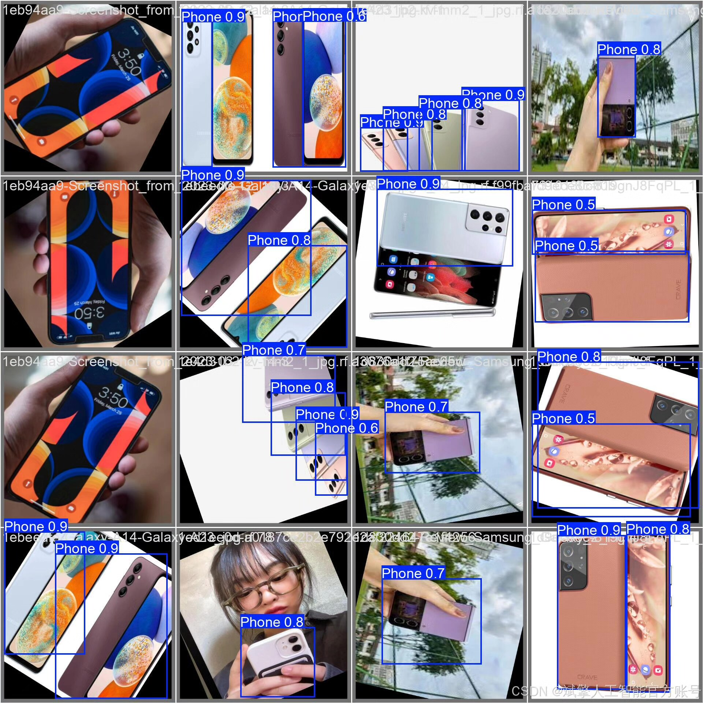

# YOLOv12 Mobile Recognition System

## Body

YOLOv12 Mobile Recognition System Based on Deep Learning YOLOv12: A Mobile Recognition and Detection System (YOLOv12+YOLO Dataset+UI Interface+Login/Registration Interface+Python Project Source Code+Model)

This article introduces a mobile target detection system based on the YOLOv12 deep learning algorithm, achieving efficient and precise mobile recognition capabilities. The system utilizes the YOLOv12 model for object detection and integrates a user-friendly UI interface, supporting login and registration functions to facilitate user management and use. The project provides complete Python source code, pre-trained models, and labeled datasets, allowing for rapid deployment in scenarios such as security monitoring and smart retail. The system is optimized for single categories of mobile phones ('Phone'), performing exceptionally well on 2700 training sets and 800 validation sets, with high detection accuracy and robustness.

✅ User Login/Registration: Supports password verification and security validation.
✅ Three Detection Modes: Based on the YOLOv12 model, supports image, video, and real-time camera detection, accurately recognizing targets.
✅ Dual-Screen Comparison: Displays the original scene and detection results simultaneously on the same screen.
✅ Data Visualization: Real-time table displays the category, confidence, and coordinates of detected targets.
✅ Intelligent Parameter Tuning: Offers a confidence slide bar to dynamically optimize detection accuracy, adapting to different scene needs.
✅ Sci-Fi Style Interactive Interface: Dark theme paired with dynamic light effects, reducing visual fatigue and enhancing operational experience.

## Images

## Payment

Here is a pay link on Stripe ( https://buy.stripe.com/3cs8yP7sY87d0vu9AB ). Please contact me lonlonago@foxmail.com after funding $89, and I will send you a complete data files , thank you!

